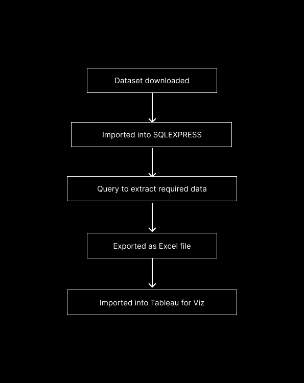

# NEPAL_COVID-19_DASHBOARD_SQL

## Project Overview
This project provides insights on COVID-19 of Nepal from Jan 2020 to Aug 2024 using a Tableau data visualization created from data queried in SQL. The visualization is publicly accessible, showcasing key patterns and trends in the dataset.

## Dataset
- [Click for public data source](https://ourworldindata.org/covid-deaths)

## SQL Query
The SQL query file is used to extract relevant data for visualization is included in the repository. This query retrieves specific fields and filters data to ensure it is ready for analysis in Tableau.

## Tableau Visualization
- Public Link: [View the Tableau Visualization](https://public.tableau.com/app/profile/mekhma.tamang/viz/NEPALCOVID-19DASHBOARD/NEPALCOVID-19DASHBOARD?publish=yes)
- Description: per day new_cases and new_deaths vizualization using line graphs with key findings.

## Key Insights
- The first human cases of COVID-19 occurred in Wuhan, People's Republic of China, on or about 17 November 2019 and in Nepal, it's in 26 January 2020. It took covid just 2 months to come over Nepal.
- Total_cases 10,03,450 and total_deaths 12,031.
- Nepal began administration of COVID-19 vaccines on 27 January 2021. 1 million Oxford-Astrazeneca vaccines were provided by India as a grant while Nepal brought 2 million doses from Serum Institute of India (SII). The complete vaccinations were registeres in 1 Febraury 2021. Nearly vaccination after 1 year of epidemic.

## Workflow

